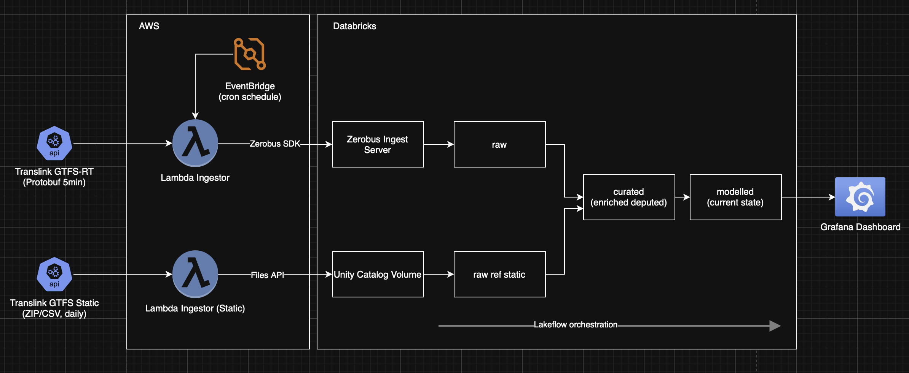
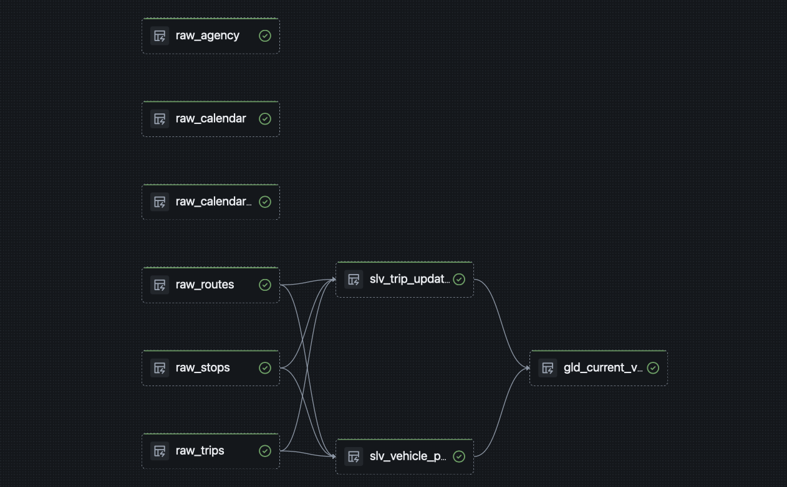
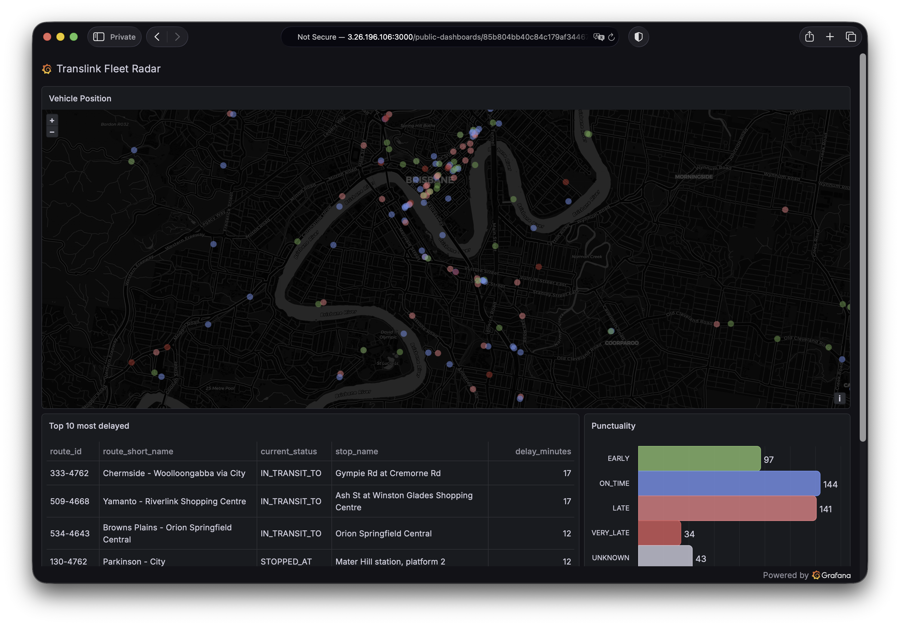

# Translink Real-Time Transit Analytics

Real-time ingestion and transformation of Queensland's public transit data (GTFS) using Databricks Lakehouse, AWS Lambda, and Lakeflow Declarative Pipelines — structured as a medallion architecture from raw protobuf streams through to analytics-ready tables and Grafana dashboards.

---

## Architecture



### How it maps to the Databricks Lakehouse

| Lakehouse Concept | Implementation in This Project |
|---|---|
| **Unity Catalog** | Single catalog with governed schema; service principal RBAC for all access |
| **Delta Lake** | All tables stored as Delta — ACID transactions, time travel, schema enforcement |
| **Zerobus Ingest** | Lambda connectors use the Zerobus SDK (edge) to stream protobuf records into the Zerobus server (Lakehouse) for sub-minute bronze appends — protobuf schema enforcement at write time catches mismatches before data lands in Delta |
| **Lakeflow Declarative Pipelines** | Declarative pipeline for bronze-ref, silver, and gold layers with automatic lineage |
| **Medallion architecture** | Bronze (raw append-only) → Silver (deduped + enriched) → Gold (current-state views) |
| **Photon engine** | Enabled on the pipeline cluster for vectorised query execution |
| **Databricks Asset Bundles** | All analytics resources (pipelines, jobs, permissions) defined as code and deployed via DABs |
| **Volumes** | Managed Volume for GTFS static CSV ingestion via Files API |

---

## Tech Stack

**Ingestion:** AWS Lambda (Python 3.13, ARM64/Graviton), EventBridge, Zerobus SDK, Protobuf
**Storage:** Delta Lake on Unity Catalog, Managed Volumes
**Transformation:** Lakeflow Declarative Pipelines (PySpark), Photon
**Deployment:** AWS SAM, Databricks Asset Bundles (DABs), Docker
**Visualisation:** Grafana OSS with Databricks datasource
**Tooling:** UV (Python), protobuf/gRPC tools

---

## Data Flow


### 1. Real-Time Ingestion (Every Minute)

Two Lambda connectors fetch GTFS Realtime protobuf feeds from Translink's public API:

- **VehiclePositions** — GPS coordinates, speed, bearing, stop status, occupancy for every active vehicle
- **TripUpdates** — Per-stop arrival/departure delay predictions (flattened: one row per stop prediction)

Each connector:
1. Fetches the binary protobuf feed and parses it with the Google GTFS-RT proto
2. Flattens nested protobuf messages into a flat table schema (custom `.proto` files matching the Delta DDL)
3. Streams records into Databricks via the **Zerobus SDK** using protobuf-typed ingest — schema is enforced at write time
4. EventBridge triggers both functions on a 1-minute cron schedule

### 2. Reference Data (Daily)

A third Lambda downloads the GTFS static ZIP (routes, stops, trips, calendar, agency) and uploads individual CSVs to a **Unity Catalog Volume** via the Databricks Files API. The pipeline reads these as bronze reference tables.

### 3. Transformation (Lakeflow Pipeline, Every 5 Minutes)

| Layer | Tables | Strategy |
|---|---|---|
| **Bronze** | `raw_vehicle_positions`, `raw_trip_updates` | Append-only via Zerobus — full history retained |
| **Bronze Reference** | `raw_routes`, `raw_stops`, `raw_trips`, `raw_calendar`, `raw_calendar_dates`, `raw_agency` | Full replace from Volume CSVs |
| **Silver** | `slv_vehicle_positions`, `slv_trip_updates` | 2-hour rolling window, deduplicated by natural key (`entity_id + feed_timestamp`), enriched with route/stop/trip names |
| **Gold** | `gld_current_vehicle_positions` | Latest position per vehicle (15-min cutoff) with real-time delay status |

**Deduplication rationale:** Bronze is append-only (Zerobus guarantees). EventBridge provides at-least-once delivery, so duplicates are expected. Silver uses `ROW_NUMBER() OVER (PARTITION BY natural_key ORDER BY ingested_at DESC)` to pick the latest record per logical event — a standard pattern for streaming dedup in Delta Lake.

**Enrichment:** Silver joins with reference tables to add human-readable route names, stop names, and trip metadata. Trip updates get a **delay category** classification:

| Category | Threshold |
|---|---|
| EARLY | delay <= -60s |
| ON_TIME | delay <= 60s |
| LATE | delay <= 300s |
| VERY_LATE | delay > 300s |

### 4. Visualisation (Grafana)

A Grafana instance connects to the Databricks SQL warehouse via the official datasource plugin, providing real-time dashboards over the gold layer tables.


---

## Project Structure

```
translink-databricks/
├── config.yml.example            # Central config template (single source of truth)
├── scripts/
│   └── sync_config.py            # Generates .env, samconfig.toml, databricks.yml from config.yml
│
├── connectors/                   # AWS Lambda connectors (SAM-managed)
│   ├── template.yaml             # SAM template — 3 Lambdas, EventBridge rules, IAM
│   ├── Makefile                  # Per-connector SAM build targets
│   ├── shared/                   # Shared GTFS-RT feed fetching & Zerobus ingest logic
│   │   ├── gtfs-realtime.proto   # Google's GTFS-RT proto definition
│   │   ├── rt_feed.py            # Protobuf feed parser + enum helpers
│   │   └── rt_ingest.py          # Zerobus stream lifecycle (create → ingest → ack → close)
│   ├── vehicle-positions/        # VehiclePositions connector + proto schema
│   ├── trip-updates/             # TripUpdates connector + proto schema
│   └── gtfs-static/              # GTFS static CSV uploader (no protobuf, uses Files API)
│
├── analytics/                    # Databricks analytics (DABs-managed)
│   ├── resources/
│   │   ├── translink_dlt.pipeline.yml   # Lakeflow pipeline definition (Photon, single-node)
│   │   ├── translink_refresh.job.yml    # 5-minute refresh schedule
│   │   └── init_catalog.job.yml         # Unity Catalog bootstrap job
│   └── src/
│       ├── init_tables.sql              # DDL: create tables, volume (IF NOT EXISTS)
│       ├── init_permissions.sql         # Grants for service principal
│       └── dlt/
│           ├── bronze_reference.py      # GTFS static CSVs → bronze ref tables
│           ├── silver_enriched.py       # Dedup + enrich → silver
│           └── gold_current.py          # Latest state → gold
│
└── dashboard/
    └── deploy_ec2.sh.example     # One-click Grafana deployment on EC2
```

---

## Getting Started

### Prerequisites

| Tool | Purpose |
|---|---|
| [UV](https://docs.astral.sh/uv/) | Python version & dependency management |
| [AWS SAM CLI](https://docs.aws.amazon.com/serverless-application-model/latest/developerguide/install-sam-cli.html) | Lambda build & deployment |
| [Docker](https://docs.docker.com/get-docker/) | Required for SAM builds (native Rust compilation) |
| [Databricks CLI](https://docs.databricks.com/dev-tools/cli/install.html) | Asset Bundle deployment |
| AWS CLI | Configured with appropriate credentials |

### 1. Clone & Configure

```bash
git clone <repo-url>
cd translink-databricks

# Create your config from the template
cp config.yml.example config.yml
# Edit config.yml with your Databricks workspace details and service principal credentials
```

The `config.yml` is the **single source of truth** for all configuration. Edit it once, then generate all downstream config files:

```bash
uv run scripts/sync_config.py
```

This generates:
- `connectors/.env` — Lambda environment variables
- `connectors/samconfig.toml` — SAM deployment config
- `analytics/databricks.yml` — DABs bundle config

### 2. Initialise Databricks (Unity Catalog)

Create your catalog in the Databricks UI first, then deploy and run the bootstrap job:

```bash
cd analytics
databricks bundle deploy -t dev
databricks bundle run init_catalog -t dev
```

This creates the schema, raw tables, Volume, and grants service principal permissions — all idempotent (`IF NOT EXISTS`).

### 3. Deploy Lambda Connectors

```bash
cd connectors
uv sync                                              # Install dependencies
uv export --frozen --no-dev --no-hashes -o requirements.txt  # Export for SAM

sam build --use-container    # Builds inside Amazon Linux (required for Rust native deps)
sam deploy                   # Deploy to AWS
```

The `--use-container` flag is essential — the Zerobus SDK includes a native Rust extension that must be compiled for the Lambda Linux runtime.

After deployment:
- VehiclePositions and TripUpdates start ingesting automatically (every minute)
- GTFS Static schedule is deployed **disabled** — verify with a manual invoke first:

```bash
sam remote invoke GtfsStaticFunction
# Once verified:
aws events enable-rule --name transit-gtfs-static-schedule --region ap-southeast-2
```

### 4. Run the Lakeflow Pipeline

```bash
cd analytics
databricks bundle run translink_analytics_pipeline -t dev
```

The refresh job runs every 5 minutes automatically after deployment. You can also trigger it manually.

### 5. (Optional) Deploy Grafana Dashboard

```bash
cd dashboard
cp deploy_ec2.sh.example deploy_ec2.sh
# Edit with your AWS VPC/subnet details
chmod +x deploy_ec2.sh && ./deploy_ec2.sh
```

This launches a `t2.xlarge` EC2 instance with Grafana pre-configured with the Databricks datasource plugin.

---

## Useful Commands

```bash
# === Lambda Operations ===
sam remote invoke VehiclePositionsFunction     # Manual trigger
sam remote invoke TripUpdatesFunction
sam logs -n VehiclePositionsFunction --tail     # Tail logs

# === Schedule Control ===
aws events disable-rule --name transit-ingestion-schedule --region ap-southeast-2  # Pause
aws events enable-rule  --name transit-ingestion-schedule --region ap-southeast-2  # Resume

# === Databricks ===
cd analytics
databricks bundle validate          # Check config
databricks bundle deploy -t dev     # Deploy resources
databricks bundle run translink_analytics_pipeline -t dev  # Trigger pipeline

# === Development ===
cd connectors
uv sync                             # Install/update dependencies
uv run python vehicle-positions/handler.py   # Run locally (needs .env)
uv run python trip-updates/handler.py

# Recompile protobuf schemas (after .proto changes)
uv run python -m grpc_tools.protoc -Ishared -Ivehicle-positions --python_out=vehicle-positions vehicle-positions/vehicle_position.proto
uv run python -m grpc_tools.protoc -Ishared -Itrip-updates --python_out=trip-updates trip-updates/trip_update.proto
```

---

## Design Decisions

| Decision | Rationale |
|---|---|
| **Protobuf for ingest schema** | Zerobus requires proto descriptors for typed streaming. Custom `.proto` files match the Delta DDL exactly — schema mismatches fail at write time, not downstream. |
| **Flat table schemas** | Nested GTFS-RT messages (TripUpdate → StopTimeUpdate[]) are flattened at the connector level. This trades storage for query simplicity — no `EXPLODE()` needed in SQL. |
| **2-hour rolling window in Silver** | Bounds compute cost as bronze grows unboundedly. Two hours covers the maximum realistic delay between ingestion and dedup processing. |
| **Single `config.yml`** | Eliminates config drift between SAM, DABs, and environment files. One edit propagates everywhere via `sync_config.py`. |
| **ARM64 Lambdas** | Graviton instances are ~20% cheaper than x86 for the same workload. SAM builds inside a Docker container to cross-compile the Rust-based Zerobus SDK. |
| **Lakeflow over manual Spark jobs** | Declarative pipeline with automatic dependency resolution, data quality expectations, and built-in lineage tracking — less operational overhead than orchestrating notebooks manually. |
| **Service principal (M2M OAuth2)** | No personal tokens in production. The service principal has scoped permissions (catalog/schema/table level) following least-privilege. |

---

## Data Sources

All data comes from [Translink's public GTFS feeds](https://gtfsrt.api.translink.com.au/) for South East Queensland — no API key required.

| Feed | Format | Frequency | Records |
|---|---|---|---|
| [VehiclePositions](https://gtfsrt.api.translink.com.au/api/realtime/SEQ/VehiclePositions) | Protobuf | Every 5 minute | ~2,000 vehicles |
| [TripUpdates](https://gtfsrt.api.translink.com.au/api/realtime/SEQ/TripUpdates) | Protobuf | Every 5 minute | ~50,000 stop predictions |
| [GTFS Static](https://gtfsrt.api.translink.com.au/GTFS/SEQ_GTFS.zip) | CSV ZIP | Daily | Routes, stops, trips, calendar |

---

## License

MIT — see [LICENSE](LICENSE).

GTFS data is provided by [Translink](https://translink.com.au/) under their open data policy.